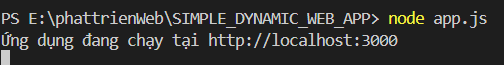
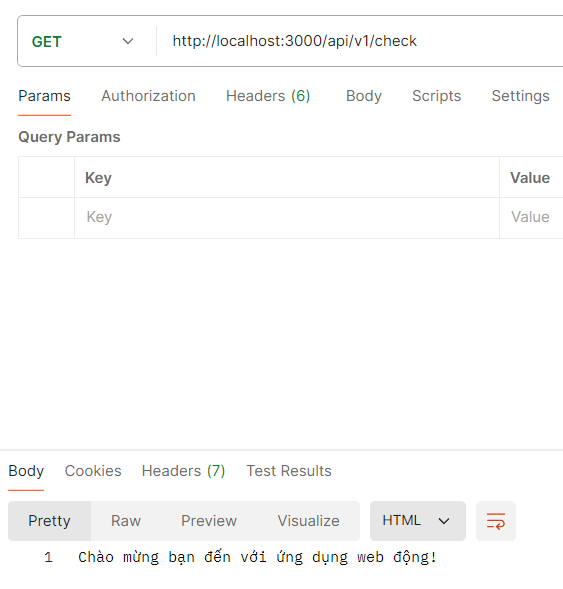
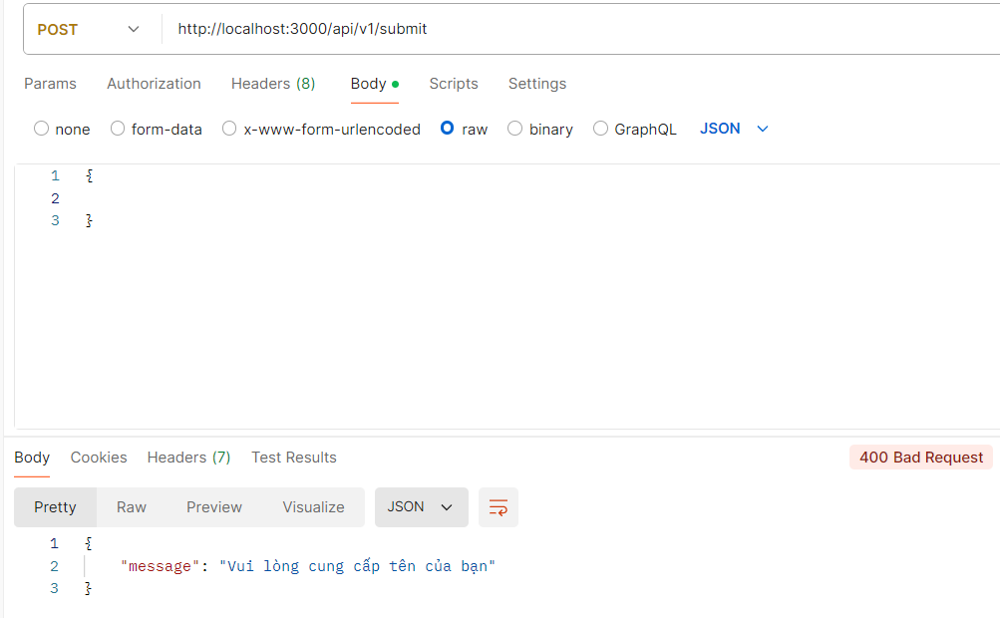

# Làm quen với ứng dụng web động đơn giản

## Mục tiêu

- Hiểu và sử dụng các khái niệm cơ bản về ứng dụng web động .
- Sử dụng HTML CSS và JavaScript để tạo giao diện đơn giản cho 1 ứng dụng web động
- Sử dụng `Node.js` và `Express` để tạo server đơn giản xử lý các yêu cầu HTTP
- Tích hợp form với logic xử lý phản hồi từ server, thực hiện thao tác gửi dữ liệu từ client lên server thông qua HTTP POST.
- Kiểm thử đơn giản với postman để kiểm tra phản hồi từ server đối với các yêu cầu GET và POST bao gồm cả trường hợp hợp lệ và không hợp lệ

## Các bước thực hiện

### Bước 1: Khởi tạo dự án Node.js

1. Mở terminal và tạo thư mục dự án:

```bash
    mkdir SIMPLE_DYNAMIC_WEB_APP
    cd SIMPLE_DYNAMIC_WEB_APP
    code .
```

**Lưu ý**: Việc này chúng ta vừa làm bằng GUI thay vì CLI như trên

2. Khởi tạo dự án Node.js:

```bash
    npm init -y
```

**Lưu ý:** cần phải cài đặt Node.js trước

### Bước 2: Cài đặt Express

- Cài đặt Express framework:

```bash
npm install express --save
```

### Bước 3: Tạo file app.js để xây dựng server

1. Trong thư mục dự án, tạo file `app.js` với nội dung:

```javacscript
  //Yêu cầu module Express
  const express = require("express");

  //Tạo 1 ứng dụng Express
  const app = express();

  //Thiết lập cổng cho server
  const port = 3000;

  //Middleware để phân tích dữ liệu từ request
  app.use(express.urlencoded({ extended: true }));

  //Middleware để phân tích dữ liệu JSON từ body của yêu cầu
  //có nghĩa là cho phép Express hiểu và xử lý dữ liệu JSON từ request
  app.use(express.json());

  //Middleware để phục vụ file tĩnh như HTML CSS Javascript từ thư mục public
  app.use(express.static("public"));

  // Middleware để phân tích dữ liệu từ form HTML
  app.use(express.urlencoded({ extended: true }));

  //Định nghĩa route chính trả về trang chào mừng khi người dùng truy cập
  app.get("/api/v1/check", (req, res) => {
    res.send("Chào mừng bạn đến với ứng dụng web động!");
  });

  //Route POST nhận dữ liệu từ client và trả về phản hồi
  // Khi client gửi dữ liệu đến địa chỉ `/submit` với phương thức POST, route này sẽ được xử lý
  app.post("/api/v1/submit", (req, res) => {
    // lấy thuộc tính 'name' từ body của request
    const { name } = req.body;

    // Nếu 'name' tồn tại sẽ trả về Chào mừng 'name'!
    if (name) {
      res.json({ message: `Chào mừng ${name}!` });
    } else {
      // Nếu 'name' không tồn tại sẽ trả về phản hồi lỗi
      res.status(400).json({ message: "Vui lòng cung cấp tên của bạn" });
    }
  });

  //Server lắng nghe tại cổng 3000
  //Khi server bắt đầu chạy, nó sẽ lắng nghe các yêu cầu từ cổng 3000
  app.listen(port, () => {
    console.log(`Ứng dụng đang chạy tại http://localhost:${port}`);
  });
```

2. Chạy server bằng lệnh:

```bash
 node app.js
```



- Nếu xảy ra lỗi bị cổng nào đang chiếm cổng 3000 thì chúng ta kiểm tra bằng lệnh :

```bash
 lsof -i :3000
```

- Sau đó dừng ứng dụng đang chiếm đóng cổng 3000:

```bash
 kill -9 <PID>
```

- Sau khi dừng PID chiếm đóng cổng 3000 thì chúng ta chạy lại server

### Bước 4: Tạo form HTML để gửi dữ liệu

1. Tạo thư mục public và file index.html với nội dung:

```html
<!DOCTYPE html>
<html lang="vi">
  <head>
    <meta charset="UTF-8" />
    <meta name="viewport" content="width=device-width, initial-scale=1.0" />
    <title>Ứng dụng web động đơn giản</title>
  </head>
  <body>
    <h1>Nhập tên của bạn</h1>

    <!-- Tạo 1 form nhập liệu  -->
    <form id="myForm">
      <!-- Nhãn và trường nhập liệu tên -->
      <label for="name">Tên:</label>
      <input type="text" name="name" id="name" required />
      <button type="submit">Gửi</button>
    </form>

    <!-- Nơi để hiển thị phản hồi từ server -->
    <p id="response"></p>

    <!-- Mã JavaScript xử lý sự kiện khi người dùng gửi form -->
    <script>
      // Lắng nghe sự kiện submit trên form
      document
        .getElementById("myForm")
        .addEventListener("submit", async function (e) {
          //Ngăn hành vi mặc định của form ngăn việc tải lại trang
          e.preventDefault();

          // Lấy giá trị nhập từ trường 'name'
          const name = document.getElementById("name").value;

          // Gửi yêu cầu POST tới server tại route '/submit'
          const response = await fetch("/api/v1/submit", {
            method: "POST", // phương thức POST để gửi yêu cầu
            headers: {
              "Content-Type": "application/json", // Định dạng nội dung gửi là Json
            },
            body: JSON.stringify({ name: name }), // Chuyển đổi đối tượng chứa tên thành chuỗi Json
          });

          // Nhận phản hồi từ server và chuyển đổi JSON thành đối tượng JavaScript
          const data = await response.json();

          // Hiển thị thông điệp từ server trong phần id = 'response' trong mã HTML ở trên
          document.getElementById("response").textContent = data.message;
        });
    </script>
  </body>
</html>
```

2. Thêm middleware để phục vụ file tĩnh trong app.js

```javascript
app.use(express.static("public"));
```

3. Thêm middleware để phân tích dữ liệu từ form ( dữ liệu gửi lên dưới dạng URL-encoded)

```javascript
app.use(express.urlencoded({ extended: true }));
```

### Bước 5 : Kiểm thử đơn giản với POSTMAN

1. Kiểm thử GET request:

- Mở Postman tạo 1 yêu cầu GET với URL: `http://localhost:3000/api/v1/check`
- Gửi yêu cầu và kiểm tra phản hồi:
  

2. Kiểm thử POST request với dữ liệu hợp lệ:

- Tạo yêu cầu POST với URL: `http://localhost:3000/api/v1/submit`
- Gửi yêu cầu và kiểm tra phản hồi:
  

3. Kiểm thử POST request với dữ liệu bị thiếu:

   
